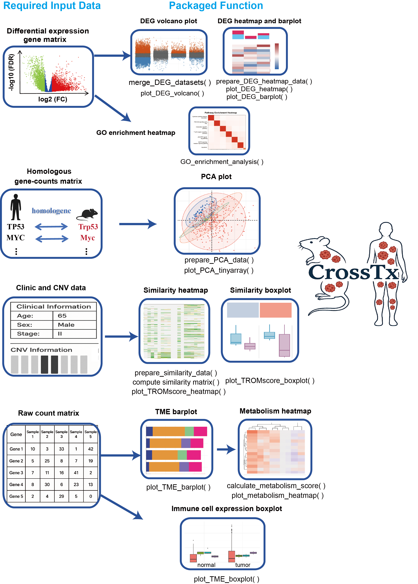
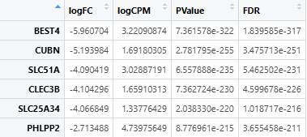
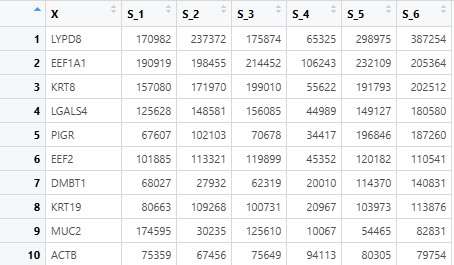
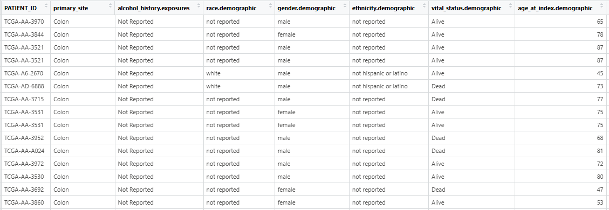
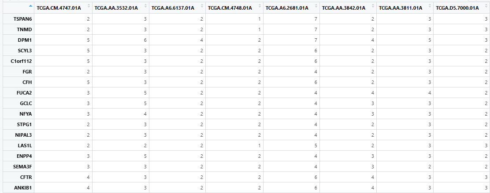

## Author: Dian Wang, Guiwen Guan

 

## Introduction

The **Cross-Species Transcriptomic Similarity Analysis R package** (**CrossTx**) provides a comprehensive and user-friendly framework for evaluating transcriptional similarities between **mouse cancer models** and **human cancer samples**. Designed to streamline cross-species transcriptomic analysis, CrossTx enables rapid, multidimensional exploration with minimal preprocessing—simply input standardized files following the provided guidelines.

The package integrates a wide array of functionalities, including differential expression gene integration and visualization, graphical display of PCA, transcriptional similarity scoring (TROM scores), immune infiltration profiling, and functional enrichment analysis (GO terms). Each function is highly customizable through flexible parameter settings, allowing researchers to tailor the analysis to specific experimental needs.

With CrossTx, users can rigorously assess how closely animal models recapitulate the molecular features of human cancers, thereby facilitating translational research at the transcriptomic level.

---

## Installation

You can install the package directly from GitHub:

```r
# Install devtools if necessary
if (!require("devtools")) install.packages("devtools")

# Install the package
devtools::install_github("wangdian-PKU/CrossTx")
```

---

## General input files to be prepared in advance

**We strongly suggest that all user - provided input files should be in the `tsv` format!!!**

1. **Expression matrix:** Differentially expressed gene matrix between the **cancer group** and the **normal group** in **mouse models**.
2. **Expression matrix:** Differentially expressed gene matrix between **human** cancer group and the normal group (**TCGA** as examples).
3. **Clinical Data:** human clinical metadata with patient IDs and different clinical conditions data.
4. **CNV Data:** human CNV alterations of specified genes (e.g., TP53, PTEN).

---

## Main Functions

### 1. Merge_DEG_datasets()— Merge differentially expressed data from human samples or mouse models 

#### 1.1 Purpose

The `merge_DEG_datasets()` function is designed to **combine differential gene expression (DEG) results** from **TCGA (human)** and **multiple mouse cancer models** into a unified, tidy data frame. This merged data can then be used to draw volcano plots of DEG downstream.

#### 1.2 Input Data Format

This function requires DEG result files from TCGA and mouse models in **`.tsv`** or **`.csv`** format. It can be derived from the DEG matrix generated by **DESeq2** or **edgeR**. These files must:

1. Be tab- or comma-separated.
2. Include at least the following columns:
   - `logFC`: Log2 fold change of gene expression.
   - `FDR`: False discovery rate (adjusted p-value).
3. Row names should be **gene symbols** or **gene identifiers**.

Example `.tsv` or `.csv` format after being read:



#### 1.3 Function Parameters

|    Argument     |    Type    | Default  |                        Description                         |
| :-------------: | :--------: | :------: | :--------------------------------------------------------: |
| human_file_path | character  | Required |       File path to TCGA DEG file (`.tsv` or `.csv`).       |
|   mouse_files   | named list | Required |     Named list of file paths to mouse model DEG files.     |
|   logFC_value   |  numeric   |    1     | Log2 fold change threshold to define "Up" or "Down" genes. |
|    FDR_value    |  numeric   |   0.05   |        FDR threshold for statistical significance.         |

#### 1.4 Output

A **merged data frame** with the following columns:

|  Column  |                       Description                        |
| :------: | :------------------------------------------------------: |
|   gene   |               Gene symbol (from row names)               |
|  logFC   |                     Log2 fold change                     |
|   FDR    |                     Adjusted p-value                     |
| contrast | Dataset source (e.g., "TCGA", "GSE172629", "Our_Model")  |
|  change  | DEG status: "Up", "Down" or "Stable" based on thresholds |

#### 1.5 DEG Classification Logic

The function uses the following rule to classify gene expression change:

```R
if (logFC > threshold & FDR < threshold) → "Up"
if (logFC < -threshold & FDR < threshold) → "Down"
otherwise → "Stable"
```

#### 1.6 Run Example

```R
# Define file paths
tcga_file <- "./data/TCGA_DEG.tsv"

mouse_files <- list(
  "Our_Model"   = "./data/Our_Model_DEG.csv",
  "GSE172629"   = "./data/GSE172629_DEG.tsv",
  "GSE208279"   = "./data/GSE208279_DEG.tsv"
)

# Merge datasets with default thresholds
merged_DEG <- merge_DEG_datasets(
  human_file_path = tcga_file,
  mouse_files = mouse_files
)

# Optional: custom thresholds
merged_DEG_custom <- merge_DEG_datasets(
  human_file_path = tcga_file,
  mouse_files = mouse_files,
  logFC_value = 1.5,
  FDR_value = 0.01
)

# View result
head(merged_DEG)

```

#### 1.7 Downstream Use Cases

1. As input for `plot_DEG_volcano()` functions.
2. For cross-species DEG pattern comparison.

#### 1.8 Notes

1. The `gene` column is automatically added from rownames of each DEG file.
2. If the input files contain missing or invalid values, the function will throw warnings or errors.
3. File format must be `.tsv` or `.csv`, other formats (e.g., Excel `.xlsx`) are not supported directly.

---

### 2. plot_DEG_volcano()— Volcano Plot for Differential Expression Analysis

#### 2.1 Purpose

The `plot_DEG_volcano()` function generates a **volcano plot** for visualizing differential expression results, highlighting significantly **upregulated**, **downregulated**, and **stable** genes, and also used to illustrate transcriptomic differences between experimental groups.

#### 2.2 Input Data Format

This function requires a data frame (output from `merge_DEG_datasets()`) with the following **mandatory columns**:

|  Column  |       Type       |                Description                 |
| :------: | :--------------: | :----------------------------------------: |
|   gene   |    character     |                 Gene name                  |
|  logFC   |     numeric      |    Log2 fold change of gene expression     |
|   FDR    |     numeric      |   False discovery rate(adjusted p-value)   |
| contrast | character/factor | Sample group identifier(e.g. TCGA, GSE...) |
|  change  |    character     |   Gene status: "Up", "Down", or "Stable"   |

Tip: Use `merge_DEG_datasets()` to generate this standardized input data frame.

#### 2.3 Function Parameters

|    Parameter    |    Type    |                           Default                            |                        Description                        |
| :-------------: | :--------: | :----------------------------------------------------------: | :-------------------------------------------------------: |
|    deg_data     | data.frame |                           Required                           |          DEG results including required columns           |
|      title      | character  |                "Volcano Plot of DEG Analysis"                |                        Plot title                         |
|      xlab       | character  |                           "Group"                            |                       X-axis label                        |
|      ylab       | character  |                      "Log2 Fold Change"                      |                       Y-axis label                        |
|     colors      | named list | `list(Up = "#e6550d", Down = "#3182bd", Stable = "#636363")` |                 Colors for DEG categories                 |
|   point_size    |  numeric   |                              2                               |                         Dot size                          |
|   alpha_range   |  numeric   |                          c(0.3, 1)                           |              Transparency range based on FDR              |
|     x_angle     |  numeric   |                              45                              |                    X-axis label angle                     |
| legend_position | character  |                           "right"                            | Legend position: "right", "top", "bottom", "left", "none" |
|      width      |  numeric   |                              10                              |                   Plot width in inches                    |
|     height      |  numeric   |                              6                               |                   Plot height in inches                   |
|   output_path   | character  |                          `"./DEG/"`                          |              Folder path to save output PDF               |

#### 2.4 Output

1. **Visual Output:**
    A ggplot object showing genes grouped by contrast, with log2 fold change on the Y-axis and group on the X-axis. The color and size of each point reflects gene regulation status and significance.
2. **File Output:**
    A PDF file named `volcano_plot.pdf` will be saved to the specified `output_path`.

#### 2.5 Run Example

```R
# Prepare merged DEG data (e.g. from TCGA and mouse models)
merged_data <- merge_DEG_datasets(
  human_file_path = "./data/TCGA_DEG.tsv",
  mouse_files = list(
    "GSE172629" = "./data/GSE172629_DEG.tsv",
    "GSE208279" = "./data/GSE208279_DEG.tsv"
  )
)

# Generate volcano plot with default settings
p <- plot_DEG_volcano(deg_data = merged_data)

# Display the plot
p

# Further customization using ggplot2
p + ggplot2::theme_minimal()

```

#### 2.6 Notes

1. Dot color is determined by the `change` column (e.g., "Up", "Down", "Stable").
2. Transparency and dot size are proportional to `-log10(FDR)`.

---

### 3. prepare_DEG_heatmap_data()— Process DEGs data for Heatmap Visualization

#### 3.1 Purpose

The `prepare_DEG_heatmap_data()` function processes **differential expression gene (DEG) results** from **TCGA** and multiple **mouse models** to prepare a standardized dataset suitable for **heatmap visualization**. It performs **significance filtering**, **homologous gene conversion**, and **logFC simplification**, returning cleaned and comparable list of matrices for downstream visualization.

#### 3.2 Input Data Format

See the file format requirements in the `merge_DEG_datasets()` documentation.

Each DEG file (both TCGA and mouse) must contain at least the following columns:

- `logFC` – log2 fold change
- `FDR` – false discovery rate (adjusted p-value)

Files must be in `.tsv` format and have gene identifiers as row names.

#### 3.3 Function Parameters

|  Argument   |   Type    | Default  |                         Description                          |
| :---------: | :-------: | :------: | :----------------------------------------------------------: |
|  tcga_file  | character | Required |            Path to the **TCGA DEG** `.tsv` file.             |
| mouse_files |   list    | Required | A **named list of file paths** to **mouse DEG** `.tsv` files. Names will be used as column prefixes. |
|    inTax    |  numeric  |   9606   |     Input species taxonomy ID (default: `9606` = human).     |
|   outTax    |  numeric  |  10090   |    Output species taxonomy ID (default: `10090` = mouse).    |

#### 3.4 What the Function Does

1. **Load and Filter TCGA Data**:

   - Reads the TCGA DEG file.

   - Selects genes with `|logFC| ≥ 1` and `FDR < 0.05`.
2. **Convert Human Genes to Mouse Homologs**:

   - Uses `homologene::homologene()` to map human genes to mouse homologs.

   - Only genes with successful mappings are retained.
3. **Count Up/Downregulated Genes**:

   - Separates positive (`logFC > 0`) and negative (`logFC < 0`) genes.
4. **Format TCGA logFC Values**:

   - Upregulated: logFC set to `1`

   - Downregulated: logFC set to `-1`

   - Others: set to `NA`
5. **Process Mouse Model Files**:

   - For each file:
     - Subsets rows to match TCGA homologs.
     - Retains only `logFC` and `FDR` columns.

#### 3.5 Output

Returns a **named list** with the following components:

|      Name       |       Type       |                         Description                          |
| :-------------: | :--------------: | :----------------------------------------------------------: |
| processed_tcga  |    data.frame    |          Filtered and formatted **TCGA DEG matrix**          |
| processed_mouse |       list       | List of **processed mouse model DEG matrices**, each with standardized logFC values |
| tcga_gene_list  | character vector |    Final set of **homologous genes** retained in analysis    |

#### 3.6 Run Example

```R
# Define file paths
tcga_path <- "./data/TCGA_DEG.tsv"
mouse_files <- list(
  "Our_Model" = "./data/Our_Model_DEG.tsv",
  "GSE172629" = "./data/GSE172629_DEG.tsv"
)

# Run preprocessing
processed_data <- prepare_DEG_heatmap_data(tcga_path, mouse_files)

# View output
head(processed_data$processed_tcga)
head(processed_data$processed_mouse$Our_Model)

```

#### 3.7 Note

1. The returned output is ready for use in the `plot_DEG_heatmap()` functions.
2. The logFC simplification logic ensures compatibility across datasets and makes interpretation of heatmaps more intuitive.

---

### 4. plot_DEG_heatmap()— Visualize Differential Expression Patterns in a Heatmap

#### 4.1 Purpose

The `plot_DEG_heatmap()` function generates a **binary expression heatmap** (values of `1`, `-1`, or `NA`) across multiple mouse models based on **TCGA-derived significant genes**. It is intended to highlight genes with **high** or **low expression** in TCGA tumors and examine their cross-species expression trends in mouse models.

This function is typically used after preparing input data with `prepare_DEG_heatmap_data()`.

#### 4.2 Input Data Format

1. This function expects the `deg_data` to be the output from `prepare_DEG_heatmap_data()`.

#### 4.3 Function Parameters

|   Argument    |     Type     |                        Default                         |                         Description                          |
| :-----------: | :----------: | :----------------------------------------------------: | :----------------------------------------------------------: |
|   deg_data    |     list     |                        Required                        | Output from `prepare_DEG_heatmap_data()`, containing filtered and formatted TCGA/mouse DEG data. |
|  mouse_files  |     list     |                        Required                        | The original named list of mouse model DEG paths used as input to `prepare_DEG_heatmap_data()`. |
|   col_names   |  character   |                          NULL                          | Optional custom column names for heatmap (default uses names from `mouse_files`). |
| cluster_rows  |   logical    |                         FALSE                          |             Whether to cluster the rows (genes).             |
| cluster_cols  |   logical    |                         FALSE                          |           Whether to cluster the columns (models).           |
| color_palette | named vector | `c("1" = "#ff7676", "-1" = "#66d4ff", "NA" = "white")` |          Color mapping for high/low/NA gene values.          |
|     width     |   numeric    |                          7.9                           |                Width of the output PDF plot.                 |
|    height     |   numeric    |                          5.95                          |                Height of the output PDF plot.                |
|  output_path  |  character   |                       `"./DEG/"`                       |          Path to save the output heatmap PDF file.           |

#### 4.4 What the Function Does

1. **Validates Input**:
   - Ensures that `deg_data` contains the expected structure.
2. **Combines Mouse Model Data**:
   - Extracts `logFC` information from each mouse model dataset.
   - Combines them into a single binary matrix (`merge_edger`) using the TCGA gene set.
3. **Assigns Row/Column Labels**:
   - Gene symbols are used as rownames.
   - Column names are either taken from `mouse_files` or user-defined via `col_names`.
4. **Plots Binary Expression Matrix**:
   - `1` → gene highly expressed in TCGA tumor samples.
   - `-1` → gene lowly expressed in TCGA tumor samples.
   - `NA` → not significant or not conserved.
   - Color-coded as red (up), blue (down), and white (NA).
   - Drawn using `ComplexHeatmap::Heatmap()` and saved to PDF.
5. **Returns Processed Matrix**:
   - Output matrix can be reused in downstream plots (e.g., `plot_DEG_barplot()`).

#### 4.5 Output

1. A **PDF heatmap** saved to the provided `output_path`.
2. The function also **returns the merged matrix** (`merge_edger`) used for `plot_DEG_barplot()`.

#### 4.6 Color Legend

| Value |            Meaning            |  Default Color   |
| :---: | :---------------------------: | :--------------: |
|   1   |   Highly expressed in tumor   | `#ff7676` (red)  |
|  -1   |   Lowly expressed in tumor    | `#66d4ff` (blue) |
|  NA   | Non-significant / Not matched |     `white`      |

Legend labels:

- `"Highly expression in tumor"` = `1`
- `"Low expression in tumor"` = `-1`

#### 4.7 Run Example

```R
# Process DEG data
processed_data <- prepare_DEG_heatmap_data(tcga_file, mouse_files)

# Generate heatmap
merge_edger <- plot_DEG_heatmap(
  deg_data = processed_data,
  mouse_files = mouse_files
)
```

#### 4.8 Notes

1. This function is tightly coupled with `prepare_DEG_heatmap_data()` — don't use it with arbitrary input.
2. You can reuse `merge_edger` for barplot visualization via `plot_DEG_barplot()`.

---

### 5. plot_DEG_barplot()— Barplot of DEG Counts in Mouse Models

#### 5.1 Purpose

The `plot_DEG_barplot()` function generates a **stacked barplot** to compare the number of **upregulated** and **downregulated** genes in each mouse model, based on **TCGA-derived gene categories**. It uses the DEG matrix generated by the `plot_DEG_heatmap()` function.

#### 5.2 Input Data Format

- The function requires a matrix (`merge_edger`) as input, which must be the output of `plot_DEG_heatmap()` and contain:

  - **Rows**: Filtered genes shared with TCGA.


  - **Columns**: Mouse models.


  - **Values**:
    - `1` for genes upregulated in TCGA tumors.
    - `-1` for downregulated genes.
    - `NA` for genes not meeting the threshold or unmatched.

#### 5.3 Function Parameters

|   Argument   |   Type    |                 Default                  |                         Description                          |
| :----------: | :-------: | :--------------------------------------: | :----------------------------------------------------------: |
| heatmap_data |  matrix   |                 Required                 | The DEG matrix from `plot_DEG_heatmap()`, indicating expression patterns per model. |
|    colors    |   list    | `list(up = "#ff7676", down = "#66d4ff")` |           Colors used for up/down-regulated genes.           |
|    width     |  numeric  |                    8                     |                 Width of the saved PDF plot.                 |
|    height    |  numeric  |                    4                     |                Height of the saved PDF plot.                 |
| output_path  | character |                `"./DEG/"`                |            Directory to save the output barplot.             |

#### 5.4 What the Function Does

1. **Validates Input**:
   - Checks that the input is a matrix with numeric values (`1`, `-1`, `NA`).
2. **Transforms Matrix to Long Format**:
   - Converts the wide-format DEG matrix into long format for `ggplot2`.
3. **Assigns Group Labels**:
   - Converts values to `"up"` (for `1`) or `"down"` (for `-1`) gene categories.
   - NA values are excluded.
4. **Generates Barplot**:
   - X-axis: Mouse model names (`contrast`).
   - Y-axis: Count of up/down genes per model.
   - Colors: Customizable (default: red for up, blue for down).
   - Uses `ggplot2::geom_bar()` to generate a clean stacked barplot.
5. **Saves Output**:
   - Barplot is saved as `"barplot.pdf"` inside the specified `output_path`.

#### 5.5 Output

|    Output     |  Type  |                         Description                          |
| :-----------: | :----: | :----------------------------------------------------------: |
| Barplot (PDF) |  file  |                 A visual file saved to disk.                 |
|  Plot Object  | ggplot | The plot is returned as a `ggplot` object for further customization. |

#### 5.6 Color Legend

|     Group     | Value in Matrix |       Color        |
| :-----------: | :-------------: | :----------------: |
|  Upregulated  |        1        | `"#ff7676"` (red)  |
| Downregulated |       -1        | `"#66d4ff"` (blue) |

#### You can change colors via the `colors` argument, for example:

```R
colors = list(up = "red", down = "blue")
```

#### 5.7 Run Example

```R
# Generate barplot from merge_edger matrix
barplot <- plot_DEG_barplot(
  heatmap_data = merge_edger,
  colors = list(up = "#ff7676", down = "#66d4ff")
)

# Display in RStudio
print(barplot)
```

#### 5.8 Notes

1. This function is intended to be used after `plot_DEG_heatmap()`.
2. Genes not matched or not significantly regulated (`NA`) are automatically excluded.
3. The returned `ggplot` object allows additional customization using the full `ggplot2` ecosystem.

---

### 6. prepare_PCA_data()- prepare data for PCA plotting

#### 6.1 Purpose

The `prepare_PCA_data()` function merges **TCGA** and **mouse model expression data**, assigns **group and batch labels**, and optionally performs **batch correction**. This prepares the data for **PCA analysis and plotting** of transcriptional similarity in downstream function `plot_PCA_tinyarray()`.

#### 6.2 Input Data Format 

Before you wanna using this fuction, you should first obtain the **homologous gene-counts matrix** files for TCGA and each mouse model, which could be obtained via the `homologene` package. The specific code and the expected data is as follows:

```R
# For TCGA
count <- read.table("./TCGA.rawcounts")
library(homologene)
homolo_gene <- homologene(rownames(count), inTax = 9606, outTax = 10090)[,c(1:2)]
count <- count[rownames(count) %in% homolo_gene[, 1], ]
rownames(count) <- toupper(rownames(count))
count <- rownames_to_column(count,var = "X") # The var parameter must set as "X"


# For mouse model
count <- read.table("./GSE.rawcounts")
library(homologene)
homolo_gene <- homologene(rownames(count), inTax = 10090, outTax = 9606)[,c(1:2)]
count <- count[rownames(count) %in% homolo_gene[, 1], ]
rownames(count) <- toupper(rownames(count))
count <- rownames_to_column(count,var = "X") # The var parameter must set as "X"
```



The input expression files (for both TCGA and mouse models) must:

1. Be in `.tsv` or `.csv` format.
2. Contain **homologene symbols** as the first column (colnames = `X`).

#### 6.3 Function Parameters

|    Parameter     |    Type    | Default  |                         Description                          |
| :--------------: | :--------: | :------: | :----------------------------------------------------------: |
|    tcga_file     | Character  | Required |   File path to TCGA expression matrix (`.csv` or `.tsv`).    |
|   mouse_files    | Named list | Required |   Named list of expression matrix paths for mouse models.    |
|  sample_counts   | Named list | Required |    Sample size info per dataset: normal and tumor count.     |
| batch_correction |  Logical   |   TRUE   | Whether to apply `ComBat` batch correction. Default: `TRUE`. |

#### 6.4 What the Function Does

1. **Reads** TCGA and mouse model expression files.
2. **Merges** all datasets using gene symbols.
3. **Generates**:
   - `group_all`: sample group labels like `TCGA_normal`, `GSExxx_tumor`.
   - `batch`: batch labels for each dataset.
4. **Applies batch correction** using `sva::ComBat()` if enabled.

#### 6.5 Output

Returns a list containing:

|     Output     |   Type    |                         Description                          |
| :------------: | :-------: | :----------------------------------------------------------: |
|  merged_data   |  matrix   |       Merged raw expression matrix (genes × samples).        |
|   group_all    | character |          Sample group labels for PCA visualization.          |
|     batch      | character |        Batch information (dataset origin per sample).        |
| corrected_data |  matrix   | Batch-corrected matrix (if `batch_correction = TRUE`). Otherwise `NULL`. |

#### 6.6 Run Example

```R
mouse_files <- list(
  "GSE172629" = "./data/GSE172629.homo.tsv",
  "GSExxxxxx" = "./data/GSExxxxxx.homo.csv"
)

sample_counts <- list(
  "TCGA" = c(normal = 50, tumor = 374),
  "GSE172629" = c(normal = 3, tumor = 3)
)

pca_data <- prepare_PCA_data(
  tcga_file = "./data/TCGA.tsv",
  mouse_files = mouse_files,
  sample_counts = sample_counts,
  batch_correction = TRUE
)
```

#### 6.7 Notes

1. File formats are **automatically detected** (`.tsv` or `.csv`).
2. All gene sets across datasets must be aligned (same gene order after merge).
3. If sample counts do not match actual column numbers, an error is thrown.
4. The output `corrected_data` is ready for **PCA**, **clustering**, or **heatmap** visualization.

---

### 7. plot_PCA_tinyarray()- PCA visualization

#### 7.1 Purpose

The `plot_PCA_tinyarray()` function performs **principal component analysis (PCA)** and visualizes the result using the `tinyarray::draw_pca()` function. It supports both **raw** and **batch-corrected** expression matrices and highlights sample grouping with **customizable colors**.

#### 7.2 Input Data Format

The function expects a list object returned from `prepare_PCA_data()`, which includes:

1. A merged expression matrix (`merged_data`)
2. Batch labels (`batch`)
3. Sample group labels (`group_all`)

- An optional batch-corrected matrix (`corrected_data`)

#### 7.3 Function Parameters

|    Parameter     |       Type       | Default  |                         Description                          |
| :--------------: | :--------------: | :------: | :----------------------------------------------------------: |
|     pca_data     |       List       | Required | Output from `prepare_PCA_data()`, must contain merged and optionally corrected matrices. |
| batch_correction |     Logical      |   TRUE   |   Whether to use batch-corrected matrix for PCA plotting.    |
|      colors      | Character vector |   NULL   | Custom color palette for groups. If `NULL`, default color palette is used. |

#### 7.4 What the Function Does

1. Selects **batch-corrected** or **raw merged** data depending on the `batch_correction` flag.
2. Converts sample group vector into a factor.
3. Automatically assigns or validates colors for each sample group.
4. Performs PCA using `tinyarray::draw_pca()`, generating a 2D PCA plot with group labels and coloring.

#### 7.5 Output

This function does **not return an object**, but **directly draws the PCA plot** to the active graphic device (RStudio Plots pane, PDF, etc.) for personalized adjustment.

#### 7.6 Run Example

```R
# Assume you have run `prepare_PCA_data()` and stored the result in `pca_data`

plot_PCA_tinyarray(
  pca_data = pca_data,
  batch_correction = TRUE  # Use ComBat-corrected data
)

# Customize colors manually (optional)
custom_colors <- c("#1b9e77", "#d95f02", "#7570b3")
plot_PCA_tinyarray(
  pca_data = pca_data,
  batch_correction = FALSE,
  colors = custom_colors
)
```

#### 7.7 Notes

1. If `batch_correction = TRUE`, but no `corrected_data` exists in the input list, the function falls back to using the original merged data.
2. Ensure that `group_all` matches the number and order of samples in the expression matrix.
3. Default colors support up to 15 groups. Beyond that, manually define a longer `colors` vector.

---

### 8. prepare_similarity_data()- combine CNV and clinical file for similarity analysis

#### 8.1 Purpose

This function prepares TCGA patient-level clinical and CNV (copy number variation) information for use in **cross-species similarity analysis** with mouse models. It extracts user-defined clinical risk factors(condition) and CNV data for selected genes and merges them into a clean, analysis-ready data frame.

#### 8.2 Input Data Format

- The input clinical_file must be separated by **tabs** and contain the column named "**PATIENT_ID**". And the character value in "PATIENT ID" should be **unique**!!! The table read using `read.table(clinic_file_path, header = TRUE, sep = "\t", stringsAsFactors = FALSE)`  is presented in the figure.



- The input cnv_file should be a tab-separated dataframe with rows representing gene symbols and columns representing TCGA PATIENT_IDs. The table read using `read.table (cnv_file_path, header=TRUE, sep="\ t", stringsAsFactors=False)` is presented in the figure.



#### 8.3  Function Parameters

|     Parameter      |   Type    | Default  |                         Description                          |
| :----------------: | :-------: | -------- | :----------------------------------------------------------: |
|    clinic_file     | character | Required | Path to the TCGA clinical file (e.g., `data_bcr_clinical_data_patient.tsv`). |
|      cnv_file      | character | Required |      Path to the TCGA CNV data file (e.g., `CNA.tsv`).       |
|   clinical_vars    | character | Required | A character vector of user-defined clinical risk factors to extract. |
|     cnv_genes      | character | Required | A character vector of gene names (e.g., `TP53`, `PTEN`) to extract from CNV. |
| risk_factor_column | character | Required | The column name in the clinical file that contains different patient conditions. |

#### 8.4 What the Function Does

1. **Reads** the clinical and CNV data from TCGA `.tsv` files.
2. **Extracts** only the `PATIENT_ID` column and the user-specified clinical variables (via pattern matching).
3. **Selects** only CNV data rows corresponding to the user-specified `cnv_genes`.
4. **Merges** CNV and clinical variables into a unified matrix using `PATIENT_ID` as the key.
5. **Encodes** CNV values as **ordered factors** with levels `-2`, `-1`, `0`, `1`.

#### 8.5 Output

A data frame containing:

- PATIENT_ID: Unique patient ID (standardized with `.` instead of `-`)
- One column per `clinical_vars`, with matched status (or NA if not present)
- One column per `cnv_genes`, representing CNV status (`-2`, `-1`, `0`, or `1`) as factors

This merged output is used as input in downstream similarity scoring functions (e.g., `compute_similarity_matrix()` → `plot_TROMscore_heatmap()`).

#### 8.6 Run Example

```R
merge_clinic_CNV <- prepare_similarity_data(
  clinic_file = "data_bcr_clinical_data_patient.tsv",
  cnv_file = "CNA.tsv",
  clinical_vars = c("Hepatitis B", "Non-Alcoholic"),
  cnv_genes = c("TP53", "PTEN"),
  risk_factor_column = "HISTORY_HEPATO_CARCINOMA_RISK_FACTORS"
)
```

#### 8.7  Notes

1. The `clinical_vars` will be matched by partial string search (case-insensitive) in the column defined by `risk_factor_column`.
2. The resulting data frame is critical for annotating heatmaps and stratifying patients based on underlying genetic and clinical profiles.

---

### 9. compute_similarity_matrix()- Calculate similarity score

#### 9.1 Purpose

The `compute_similarity_matrix()` function calculates a **transcriptional similarity matrix** between **TCGA samples** and **mouse models**, using the `ws.trom()` algorithm from the `TROM` package. It filters the similarity matrix to retain only biologically meaningful comparisons (tumor-tumor and normal-normal) and merges the filtered matrix with TCGA clinical and CNV data for downstream analysis.

#### 9.2 Input Data Format

The input `expression_matrix` should be the **batch-corrected expression matrix** (typically the output from `prepare_PCA_data()`), where:

- **Rows** represent genes.
- **Columns** represent TCGA and mouse model samples.
- **Row names** are gene symbols.

The input `merge_clinic_CNV` is the processed **clinical + CNV** data result from prepare_similarity_data()

#### 9.3 Function Parameters

|     Parameter     |    Type    | Default  |                         Description                          |
| :---------------: | :--------: | :------: | :----------------------------------------------------------: |
| expression_matrix |   matrix   | Required |     Batch-corrected expression matrix (genes × samples).     |
|     group_all     | charactor  | Required |   Vector of sample group labels for TCGA and mouse models.   |
| tcga_sample_size  |  numeric   | Required |                Total number of TCGA samples.                 |
| tcga_normal_count |  numeric   | Required |           Number of normal samples in TCGA cohort.           |
| merge_clinic_CNV  | data frame | Required | Data frame containing TCGA clinical and CNV data (from `prepare_similarity_data()`). |
|     cnv_genes     | charactor  | Required |   Character vector of CNV genes to include in the output.    |
|   clinical_vars   | charactor  | Required | Character vector of clinical variables to include in the output. |

#### 9.4 What the Function Does

1. **Calculates transcriptional similarity matrix** using `TROM::ws.trom()` between TCGA and mouse models.
2. **Filters out irrelevant comparisons**:
   - Removes **tumor-normal** and **normal-tumor** comparisons.
   - Retains only **tumor-tumor** and **normal-normal** similarities.
3. **Appends clinical annotations** and CNV data to the filtered matrix.
4. **Sorts the final matrix** by tissue type and clinical/CNV variables.

#### 9.5 Output

The function returns a named list with two components:

- `similarity_matrix`: The **full similarity matrix** (unfiltered), as computed by `ws.trom()`.
- `dm_trom_del_backgroud_clinic`: The **filtered similarity matrix** (excluding background noise), merged with clinical and CNV data for use in `plot_TROMscore_heatmap()` and `plot_TROMscore_boxplot()`.

#### 9.6 Run Example

```R
similarity_results <- compute_similarity_matrix(
  expression_matrix = pca_data$corrected_data,
  group_all = pca_data$group_all,
  tcga_sample_size = 424,
  tcga_normal_count = 50,
  merge_clinic_CNV = merge_clinic_CNV,
  cnv_genes = c("TP53", "PTEN"),
  clinical_vars = c("Hepatitis B", "Non-Alcoholic")
)
```

#### 9.7 Notes

1. `ws.trom()` performs cross-species comparison based on gene expression similarity and returns a matrix of TROM scores.
2. The filtering step ensures that only biologically comparable samples (tumor vs. tumor, normal vs. normal) are retained.
3. The function requires accurate `group_all` labeling, where TCGA samples are listed first.
4. The `PATIENT_ID` is inferred from the first 12 characters of TCGA sample IDs.

---

### 10. plot_TROMscore_heatmap()- TROM similarity score heatmap visualization

#### 10.1 Purpose

The `plot_TROMscore_heatmap()` function generates a **heatmap visualization** of transcriptional similarity scores (TROM scores) between **TCGA samples** and **mouse cancer models**. It provides a high-level overview of how closely mouse models resemble different human tumor subtypes at the transcriptomic level. It also integrates CNV and clinical information in TCGA samples.

#### 10.2 Input Data Format

1. `dm_trom_del_backgroud_clinic`: The data frame from `compute_similarity_matrix()`, containing filtered similarity scores merged with clinical and CNV data.
2. `trom_matrix`: The data frame from `compute_similarity_matrix()`, containing the raw TROM similarity matrix before background filtering.
3. Sample groupings and counts must match those used in earlier PCA and similarity computations (e.g., from `prepare_PCA_data()` and `compute_similarity_matrix()`).

#### 10.3 Function Parameters

|          Parameter           |    Type    |              Default              |                         Description                          |
| :--------------------------: | :--------: | :-------------------------------: | :----------------------------------------------------------: |
| dm_trom_del_backgroud_clinic | data frame |             Required              | Data frame with filtered similarity scores and clinical annotations. |
|         trom_matrix          |   matrix   |             Required              |  Raw similarity matrix from `ws.trom()` (before filtering).  |
|       tcga_sample_size       |  numeric   |             Required              |                Total number of TCGA samples.                 |
|      tcga_normal_count       |  numeric   |             Required              |              Number of normal samples in TCGA.               |
|      model_group_count       |  numeric   |             Required              |             Total number of mouse model samples.             |
|          condition           | named list |             Required              | Named list defining sample counts per mouse model condition. |
|        clinical_vars         | character  |             Required              | Vector of clinical variables to annotate (e.g., "Hepatitis B"). |
|          cnv_genes           | character  |             Required              | Vector of CNV genes used for annotations (e.g., "TP53", "PTEN"). |
|          group_all           | character  |             Required              |     Vector with group labels from `prepare_PCA_data()`.      |
|            width             |  numeric   |               11.84               |               Width of the output PDF heatmap.               |
|            height            |  numeric   |               7.11                |              Height of the output PDF heatmap.               |
|         output_path          | character  | `"./similarity/TROM_heatmap.pdf"` |               Path to save the heatmap figure.               |
|         cluster_rows         |  logical   |               FALSE               |           Whether to cluster rows in the heatmap.            |
|         cluster_cols         |  logical   |               FALSE               |          Whether to cluster columns in the heatmap.          |

#### 10.4 What the Function Does

1. **Extracts TROM scores** for TCGA and mouse model samples.
2. **Computes average TROM scores** for each mouse model group (tumor/normal).
3. **Formats the similarity matrix** into a structure suitable for `ComplexHeatmap`.
4. **Adds two layers of annotations**:
   - **Column annotations**: whether each mouse model sample is tumor or normal.
   - **Row annotations**: TCGA clinical and CNV information.
5. **Draws and saves the heatmap** using the `ComplexHeatmap` package.

#### 10.5 Output

The function returns a list with two elements:

1. `heatmap_obj`: The drawn heatmap object (from `ComplexHeatmap::draw()`).
2. `merge_long`: A long-format data frame containing:
   - `x`: Mouse model sample label.
   - `y`: Mean similarity score.
   - `group`: Tumor or normal.
   - `condition`: Experimental model condition.
   - `score`: Rounded average TROM score.

This `merge_long` object is used directly as input for `plot_TROMscore_boxplot()`.

#### 10.6 Run Example

```R
heatmap_results <- plot_TROMscore_heatmap(
  dm_trom_del_backgroud_clinic = similarity_results$dm_trom_del_backgroud_clinic,
  trom_matrix = similarity_results$similarity_matrix,
  tcga_sample_size = 424,
  tcga_normal_count = 50,
  model_group_count = 52,
  condition = list("HBV pten p53 ko" = 5, "DEN Cl4" = 16),
  clinical_vars = c("Hepatitis B", "Non-Alcoholic"),
  cnv_genes = c("TP53", "PTEN"),
  group_all = pca_data$group_all,
  output_path = "./similarity/TROM_heatmap.pdf"
)
```

#### 10.7 Notes

1. This heatmap emphasizes **tumor-to-tumor** and **normal-to-normal** transcriptional similarity across species.
2. Colors are mapped from low (white) to high (deep red) TROM scores using `circlize::colorRamp2()`.
3. Clinical annotations are reversed (`rev()`) to align correctly with TCGA row order in the matrix.
4. The `merge_long` result can be reused for barplots or boxplots of similarity scores.
5. The function automatically creates directories if `output_path` does not exist.

---

### 11. plot_TROMscore_boxplot()- TROM similarity score boxplot visualization

#### 11.1 Purpose

The `plot_TROMscore_boxplot()` function generates two types of plots to **visualize transcriptional similarity scores (TROM scores)**:

1. A **boxplot** that compares TROM scores between tumor and normal groups across mouse models.
2. A **tileplot** that displays the **average TROM score** for each mouse model.

These visualizations help assess which mouse models **best resemble** specific TCGA tumor profiles.

#### 11.2 Input Data Format

- The input `merge_long` should be the **output from `plot_TROMscore_heatmap()`**, a data frame in long format containing:
  - `x`: sample labels
  - `y`: TROM score
  - `group`: "tumor" or "normal"
  - `condition`: experimental condition/group
  - `score`: average score (used in tileplot)

#### 11.3 Function Parameters

|   Parameter   |    Type     |            Default            |                         Description                          |
| :-----------: | :---------: | :---------------------------: | :----------------------------------------------------------: |
|  merge_long   | data frame  |           Required            | Data frame from `plot_TROMscore_heatmap()`, containing TROM scores. |
|  output_path  |  character  | `"./similarity/TROM_boxplot"` |         Path prefix for saving the output PDF file.          |
| combine_plots | plot_object |             TRUE              | Whether to return a **combined** tileplot and boxplot figure. |

#### 11.4 What the Function Does

1. **Checks input**: Ensures that `merge_long` contains the required columns.
2. **Generates a boxplot**: Displays similarity score distributions per condition (tumor/normal) using `ggplot2::geom_boxplot()`.
3. **Computes average scores** per condition and generates a **tileplot** using `ggplot2::geom_tile()`.
4. **Combines plots vertically** using `patchwork::plot_layout()` if `combine_plots = TRUE`.
5. **Saves the final plot** to the specified output directory as a `.pdf`.

#### 11.5 Output

- If `combine_plots = TRUE`, returns a **single combined `ggplot` object**.
- If `combine_plots = FALSE`, returns a **list of two ggplot objects**: `list(tileplot, boxplot)`.
- A PDF file named `TROM_boxplot.pdf` is saved to the `output_path`.

#### 11.6 Run Example

```R
plot_TROMscore_boxplot(
  merge_long = heatmap_results$merge_long,
  output_path = "./similarity/TROM_boxplot",
  combine_plots = TRUE
)
```

#### 11.7 Notes

1. The tileplot **highlights model-level mean similarity scores** using a color gradient (blue → white → red).
2. The boxplot separates tumor/normal groups per condition for **distributional comparison**.
3. A vertical dashed line (`xintercept = 2.6`) is included for visual reference (e.g., model split).
4. You may modify the returned ggplot object(s) using `+ theme()` or other `ggplot2` functions.

---

### 12. GO_enrichment_analysis()

#### 12.1 Purpose

This function performs **Gene Ontology (GO) enrichment analysis** on differentially expressed genes (DEGs) identified from `edgeR` results. It supports analysis across species (`human`, `mouse`, `rat`) and GO categories (`BP`, `MF`, `CC`). The enriched GO terms are visualized using **GO term similarity clustering** via `simplifyGO`.

#### 12.2 Input Data Format

Please refer to the input data structure described in the `merge_DEG_datasets()` documentation.

#### 12.3 Function Parameters

|  Parameter   |   Type    |    Default     |                         Description                          |
| :----------: | :-------: | :------------: | :----------------------------------------------------------: |
|   deg_file   | character |    Required    | File path to DEG results (`.tsv` or `.csv`) with `logFC` and `FDR` columns. |
|   species    | character |    Required    |  One of `"hsa"`, `"mmu"`, `"rno"` for human, mouse, or rat.  |
|    org_db    | character |    Required    |    Organism annotation database (e.g., `"org.Hs.eg.db"`).    |
|     ont      | character |      "BP"      | GO ontology type: `"BP"` (Biological Process), `"MF"` (molecular function), or `"CC"` (cellular component). |
| column_title | character |    Required    |          Title shown in the GO similarity heatmap.           |
|    width     |  numeric  |     10.36      |                 Width of the saved PDF plot.                 |
|    height    |  numeric  |      6.35      |                Height of the saved PDF plot.                 |
| output_path  | character | "./enrichment" | Directory to save output PDF. Will be created if it doesn't exist. |

#### 12.4 What the Function Does

1. **Reads** the DEG file and filters genes with `|logFC| > 1` and `FDR < 0.05`.
2. **Maps gene symbols to gene IDs** using the specified `OrgDb` package (e.g., `org.Hs.eg.db`).
3. **Performs GO enrichment** using `clusterProfiler::enrichGO()`.
4. **Calculates GO term similarity** using `simplifyEnrichment::GO_similarity()`.
5. **Saves a GO similarity heatmap** to a PDF using `simplifyGO()`.

#### 12.5 Output

- A `.pdf` file showing **GO term similarity clustering**, saved to `output_path`.

#### 12.6 Run Example

```R
GO_enrichment_analysis(
  deg_file = "./data/TCGA_DEG.tsv",
  species = "hsa",
  org_db = "org.Hs.eg.db",
  ont = "BP",
  column_title = "TCGA_GO_BP_terms"
)
```

#### 12.7 Notes

1. Be sure to **install and load** the corresponding organism annotation package (`org.Hs.eg.db`, `org.Mm.eg.db`, or `org.Rn.eg.db`) before running the function.
2. Input DEG file must contain **row names as gene symbols**, and columns `logFC` and `FDR`.
3. The output file will be overwritten if one with the same name already exists in the output path.

---

### 13. plot_TME_barplot()- Tumor Microenvironment cell composition visualization

#### 13.1 Purpose

This function performs **immune infiltration analysis** from **differential expression gene matrix** using various deconvolution methods (e.g., CIBERSORT, xCell), and visualizes the **relative abundance of immune cell types** across experimental groups in a **stacked barplot**.

#### 13.2 Input Data Format

Please refer to the input format described in the documentation for `merge_DEG_datasets()`. The input can be either:

- A **raw count matrix** (genes × samples), or
- A **TPM matrix** (if `input_type = "TPM"`), with matching gene identifiers.

#### 13.3 Function Parameters

|  Parameter  |   Type    | Default  |                         Description                          |
| :---------: | :-------: | :------: | :----------------------------------------------------------: |
| data_matrix |  matrix   | Required |  Matrix or data frame. Either raw count matrix or TPM data.  |
| input_type  | character | "count"  | Specify `"count"` to convert counts to TPM or `"TPM"` to use data directly. |
|   method    | character | Required | Immune deconvolution method: `"cibersort"`, `"mcpcounter"`, `"xcell"`, or `"quantiseq"`. |
|  group_as   | character | Required | Character vector defining the **group of each sample** (must match column order). |
| output_path | character | "./TME"  |       Directory to save output plots and result files.       |
|   height    |  numeric  |   5.2    |         Height (in inches) of the saved PDF barplot.         |
|    width    |  numeric  |    10    |         Width (in inches) of the saved PDF barplot.          |

#### 13.4 What the Function Does

1. **Checks input** validity and converts **counts to TPM** using `IOBR::count2tpm()` (if needed).
2. Runs **immune deconvolution** via `IOBR::deconvo_tme()` using the specified method.
3. Aggregates the infiltration results **by sample group**.
4. Generates a **stacked barplot** using `IOBR::cell_bar_plot()`.

#### 13.5 Output

- **PDF Figure**: A stacked barplot (`method_cell_bar_plot.pdf`) visualizing immune cell compositions.
- **CSV Table**: Cell abundance table (`method_result.csv`) for all samples.
- **Returned List**:
  - `eset_tpm`: TPM-normalized expression matrix (used in analysis)
  - `method_model`: Full immune infiltration results (before group merging)

#### 13.6 Run Example

```R
group_as <- c(
  rep("TCGA_normal", 50),
  rep("TCGA_tumor", 374),
  rep("HBV_Pten_KO_normal", 3),
  rep("HBV_Pten_KO_tumor", 3)
)

TME_barplot_result <- plot_TME_barplot(
  data_matrix = merge.data,
  input_type = "count",
  method = "cibersort",
  group_as = group_as
)

# Extract TPM for downstream analysis
eset_tpm <- TME_barplot_result$eset_tpm
```

#### 13.7 Notes

1. Ensure **group_as** matches the sample order in `data_matrix`.
2. Supported species for TPM conversion (`count2tpm`) is currently `"hsa"` only. Modify `org =` parameter if needed.
3. Deconvolution methods depend on package `IOBR`; make sure it's properly installed and loaded.
4. Output will be written to `output_path` as `.pdf` and `.csv`.

---

### 14. calculate_metabolism_score()

#### 14.1 Purpose

This function calculates **metabolism-related gene signature scores** from TPM-normalized RNA-seq expression data.

#### 14.2 Input Data Format

Same as described in the `plot_TME_barplot()` documentation. The input must be a **TPM matrix** (genes × samples) with gene identifiers as row names and sample names as column names. Typically generated from `plot_TME_barplot()`.

#### 14.3 Function Parameters

|    Parameter    |   Type    | Default  |                         Description                          |
| :-------------: | :-------: | :------: | :----------------------------------------------------------: |
|    eset_tpm     |  matrix   | Required | TPM-normalized gene expression matrix. Typically obtained from `plot_TME_barplot()`. |
|     method      | character |  "pca"   | Method used for signature scoring. Options: `"pca"`, `"ssgsea"`, `"zscore"`, `"integration"`. |
| mini_gene_count |  numeric  |    2     | Minimum number of genes required to calculate score for a given signature. |

#### 14.4 What the Function Does

1. Validates input format and parameter values.
2. Calls `IOBR::calculate_sig_score()` using a **predefined metabolism signature** (`"signature_metabolism"`).
3. Computes metabolism signature scores **per sample** using the selected scoring method.

#### 14.5 Output

- A **data frame** where:
  - **Rows** represent samples.
  - **Columns** contain the metabolism score (or multiple scores, depending on method).

This can be used for **downstream comparison**, **group visualization**, or **correlation analysis**.

#### 14.6 Run Example

```R
# Assume eset_tpm is output from plot_TME_barplot()
sig_meta <- calculate_metabolism_score(
  eset_tpm = eset_tpm,
  method = "pca",
  mini_gene_count = 2
) 
```

#### 14.7 Notes

1. This function uses a **fixed internal metabolism gene signature** from `IOBR`.
2. PCA-based scores reflect the **first principal component** of metabolism-related gene expression.
3. If too few genes are available for scoring (`mini_gene_count` not met), those samples may be excluded.
4. Make sure `IOBR` is properly installed and loaded before running this function.

---

### 15. plot_metabolism_heatmap()- metabolism score visualization

#### 15.1 Purpose

This function generates a **heatmap visualization** of metabolism-related signature scores across sample groups.

#### 15.2 Input Data Format

The input `sig_meta` must be a **data frame** of metabolism signature scores, usually the output from `calculate_metabolism_score()`.
 It must include a **first column identifying group labels** (e.g., `group_as`).

#### 15.3 Function Parameters

|     Parameter      |    Type    |     Default      |                         Description                          |
| :----------------: | :--------: | :--------------: | :----------------------------------------------------------: |
|      sig_meta      | data frame |     Required     |    Data frame output from `calculate_metabolism_score()`.    |
|    output_path     | character  | `"./metabolism"` | Path to save the PDF heatmap. Directory will be created if it doesn't exist. |
| clustering_memthod | character  |  `"manhattan"`   | Distance metric for hierarchical clustering. Choices: `"manhattan"` or `"canberra"`. |
|       width        |  numeric   |        10        |             Width of the output PDF (in inches).             |
|       height       |  numeric   |        22        |            Height of the output PDF (in inches).             |
|   row_name_width   |  numeric   |        7         |         Maximum width for row names in centimeters.          |
|   right_padding    |  numeric   |        6         |      Right margin in centimeters to avoid label cutoff.      |
|   row_height_pt    |  numeric   |        5         |            Height of each heatmap row in points.             |

#### 15.4 What the Function Does

1. **Aggregates** metabolism scores by group using `group_as` (must be defined globally).
2. **Transposes** the matrix so that pathways are rows and sample groups are columns.
3. Uses **`ComplexHeatmap::Heatmap()`** to create a heatmap.
4. Applies **custom clustering method** to both rows and columns.
5. **Saves** the plot as a PDF file in the specified `output_path`.

#### 15.5 Output

- A **heatmap PDF file** named `heatmap.pdf` saved to `output_path`.

#### 15.6 Run Example

```R
# Assuming `sig_meta` is the output of `calculate_metabolism_score()`
heatmap_obj <- plot_metabolism_heatmap(
  sig_meta = sig_meta,
  output_path = "./metabolism/",
  clustering_method = "canberra",
  width = 10,
  height = 22
)
```

#### 15.7 Notes

1. If `group_as` is not found or doesn't match the sample structure, the function will fail silently or return incorrect results.
2. Distance metric selection (`manhattan` vs `canberra`) can influence clustering results; try both to explore structure.
3. Heatmap is saved **automatically**; no need to call `ggsave()` or other output functions.

---

### 16. plot_TME_boxplot()- immune infiltration scores boxplot visualization

#### 16.1 Purpose

This function computes **immune infiltration scores** using the **CIBERSORT** method and visualizes them via **boxplots** for each immune signature. It is primarily used to compare immune cell composition between groups across different **mouse models** or **experimental conditions**.

#### 16.2 Input Data Format

- **TPM Expression Matrix**
   A `data.frame` of gene expression values (TPM), **genes × samples** format.
   Usually generated by `plot_TME_barplot()`.
- **Group Labels (`group_as`)**
   A `character vector` of group labels in the format `"condition_group"`
   (e.g., `"HBV_normal"`, `"HBV_tumor"`, `"DEN_normal"`).
- **Condition List (`condition_list`)**
   A **named list** specifying the number of samples per mouse model:

```R
condition_list <- list("GSEXXX" = 6, "GSExxx" = 8)
```

#### 16.3 Function Parameters

|   Parameter    |   Type    |     Default      |                         Description                          |
| :------------: | :-------: | :--------------: | :----------------------------------------------------------: |
|    eset_tpm    |  matrix   |     Required     | TPM-transformed expression matrix. Output of `plot_TME_barplot()`. |
|    group_as    | character |     Required     | Vector of group labels, e.g., `"HBV_tumor"`; must match column order of `eset_tpm`. |
| condition_list | character |     Required     | Named list showing sample counts per mouse model. Used for `factor()` levels. |
|     width      |  numeric  |        10        |          Width (in inches) of the output PDF plot.           |
|     height     |  numeric  |        6         |          Height (in inches) of the output PDF plot.          |
|  output_path   | character | "./TME_boxplots" | Directory to save the PDF files. Created automatically if it doesn’t exist. |

#### 16.4 What the Function Does

1. Runs **CIBERSORT** via `IOBR::deconvo_tme()` to get immune cell fractions.
2. Iterates through each immune signature (e.g., B cells, macrophages, etc.).
3. Generates **ggplot boxplots** showing infiltration score distribution across groups.
4. Saves each immune signature boxplot as a **PDF file** in the specified output path.

#### 16.5 Output

- A series of **PDF files** (one per immune signature) saved to `output_path`.

#### 16.6 Run Example

```R
# Define sample count per condition
condition_list <- list("GSEXXX" = 6, "GSExxx" = 8)

# Run boxplot function
plot_list <- plot_TME_boxplot(
  eset_tpm = TME_barplot_result$eset_tpm,
  group_as = group_as,
  condition_list = condition_list
)
```

#### 16.7 Notes

- The function currently supports only the **CIBERSORT** method by default.
- You can customize colors and themes by post-editing the **ggplot** objects returned.

---

## Visualization Outputs

All plots generated are **publication-ready**, saved in **PDF** format by default, and include:

1. DEG Volcano plots, Heatmaps, Barplots
2. PCA Plots
3. TROM Score Heatmaps, Boxplots, Barplots
4. Immune Infiltration Barplots, Boxplots
5. GO Enrichment Similarity Plots
6. Metabolism Heatmap

---

## Contributions & Issues

We warmly welcome contributions and suggestions! Please feel free to open an issue or pull request.

---

## Contact

- **Author:** *Dian Wang*, Guiwen Guan
- **Email:** wangdian020803@gmail.com
- **GitHub:**[CrossTx](https://github.com/wangdian-PKU/CrossTx)

---

## Thanks for very much for using our package📦!
